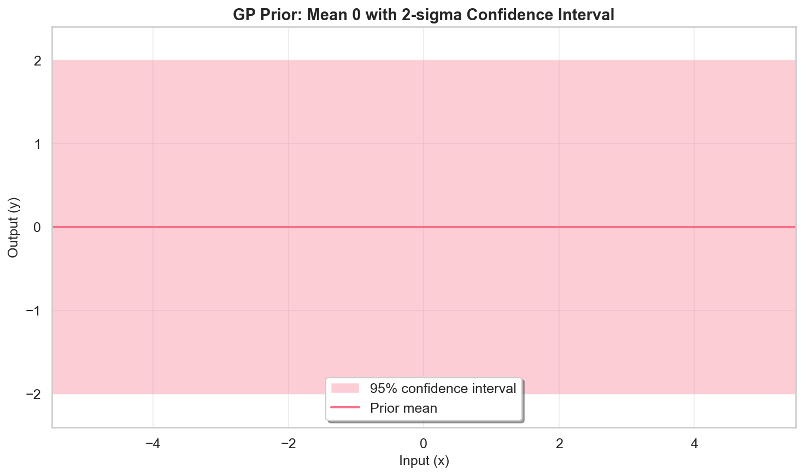
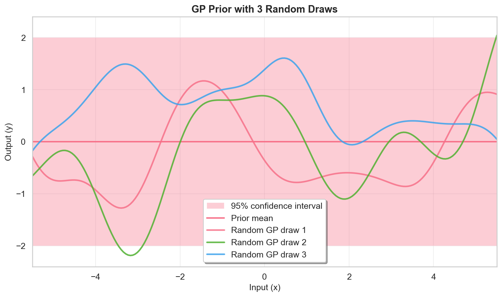
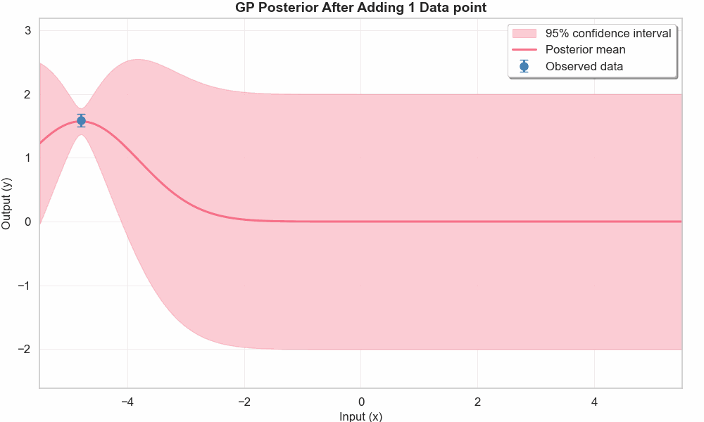
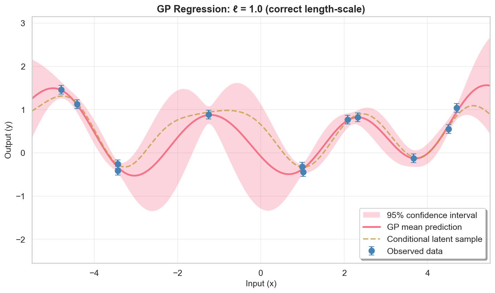
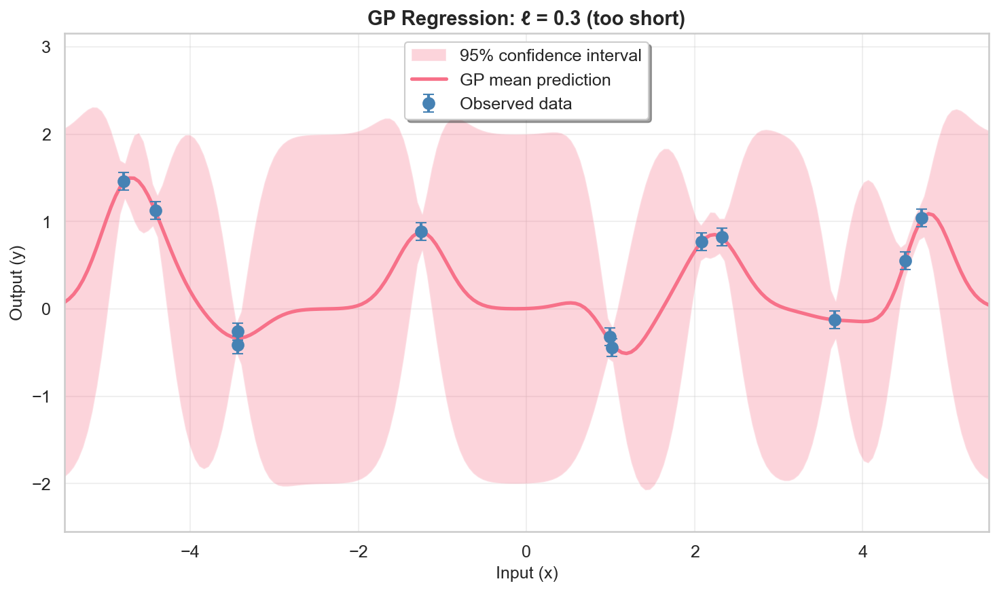
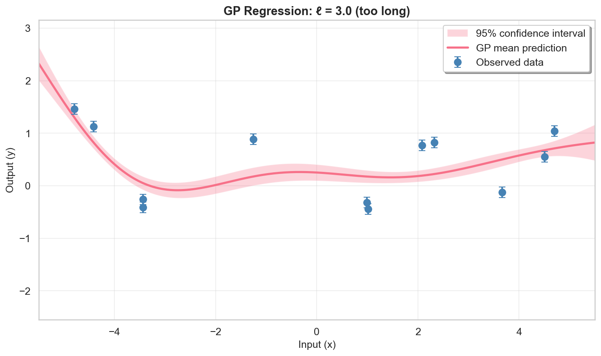
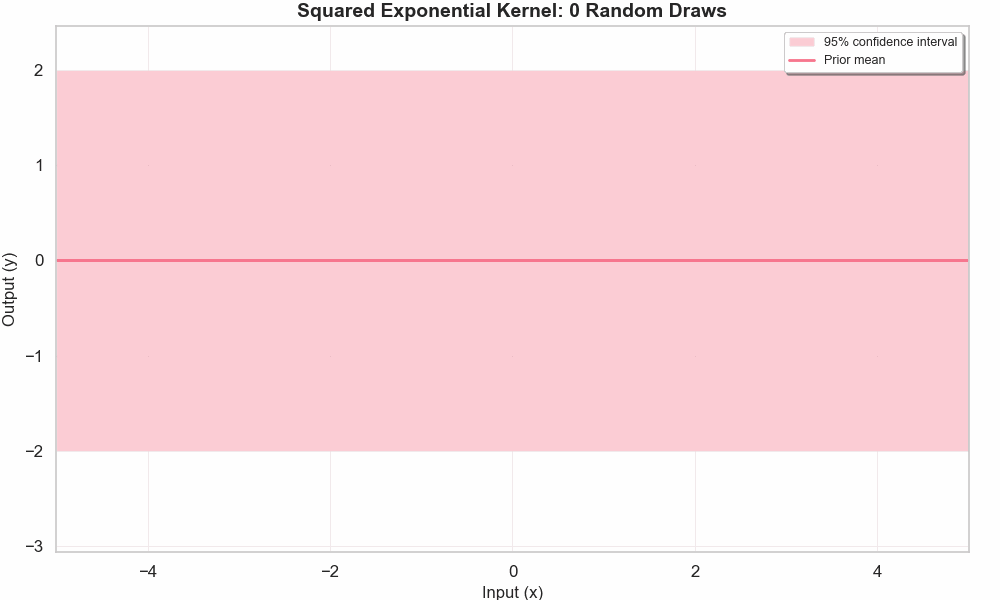
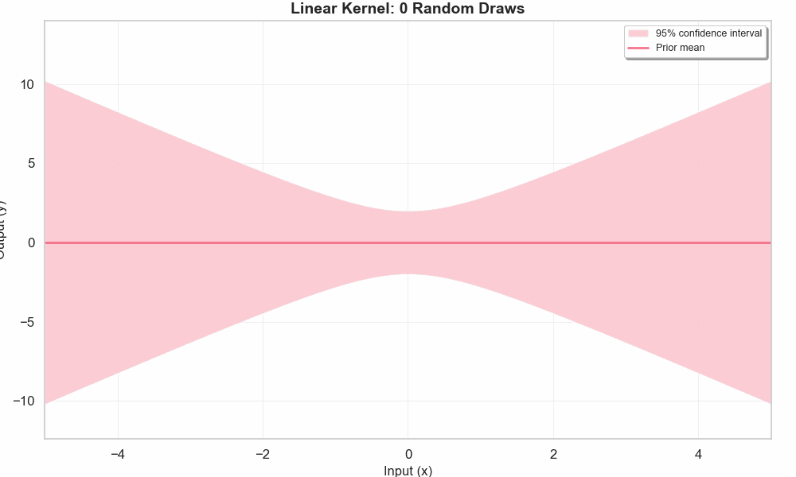
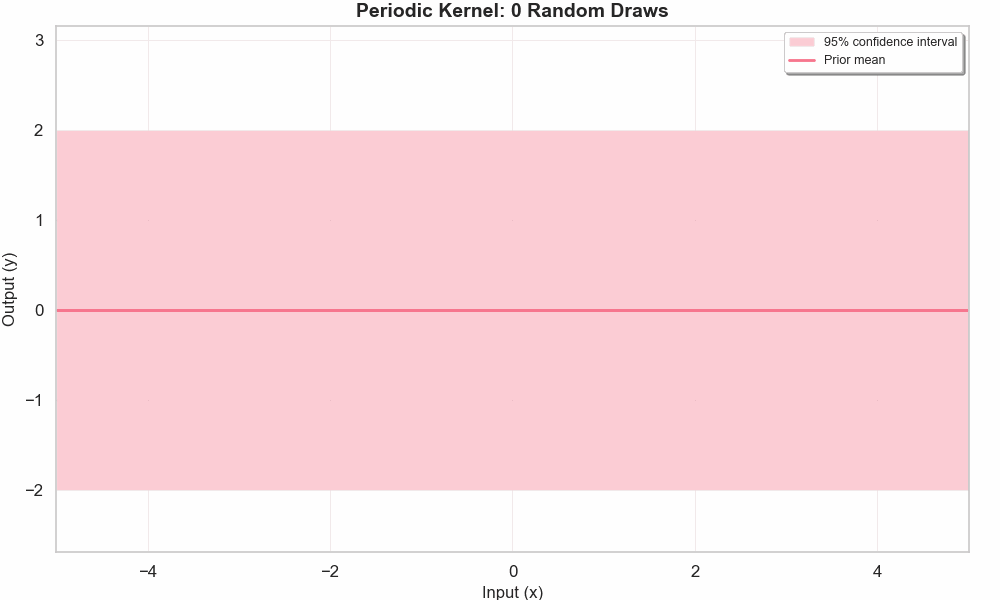

# Gaussian Process Visualizations

A collection of  Jupyter notebooks that build up intuition for **Gaussian Processes (GPs)** through step-by-step visualizations.

## Examples

### `gp_prior_posterior.ipynb` — GP Prior -> Posterior
- GP **prior** mean with 2-sigma confidence band
- GP prior with 3 random draws
- GP **posterior** updating as observations are added one by one (animation)

| Prior CI | Prior + random draws | Posterior (updating) |
|---|---|---|
|  |  |  |

### `gp_hyperparams.ipynb` — Effect of hyperparameter
Demonstrates GP regression with a squared-exponential (RBF) kernel on synthetic data:
- Raw data with noise error bars
- GP fit with the **correct** length-scale (ℓ = 1.0)
- GP fit with a **too-short** length-scale (ℓ = 0.3) — over-fitting
- GP fit with a **too-long** length-scale (ℓ = 3.0) — under-fitting
- Random function samples drawn from each model

| Correct ℓ | Short ℓ | Long ℓ |
|---|---|---|
|  |  |  |


### `gp_kernels.ipynb` — Kernel Comparison
Shows random draws from the GP prior and posterior fitting for three kernels: Squared Exponential, Linear, and Periodic.

| Squared Exponential | Linear | Periodic |
|---|---|---|
|  |  |  |

## Installation

```bash
pip install -e .
```

## Usage
Open the notebooks in Jupyter / VS Code to explore interactively with inline animation players:

| Notebook | Contents |
|---|---|
| `gp_prior_posterior.ipynb` | GP prior CI, random draws, posterior update animation |
| `gp_hyperparams.ipynb` | GP regression with correct, too-short, and too-long length-scales |
| `gp_kernels.ipynb` | Prior draws + posterior fitting animations for SE, Linear, and Periodic kernels |

