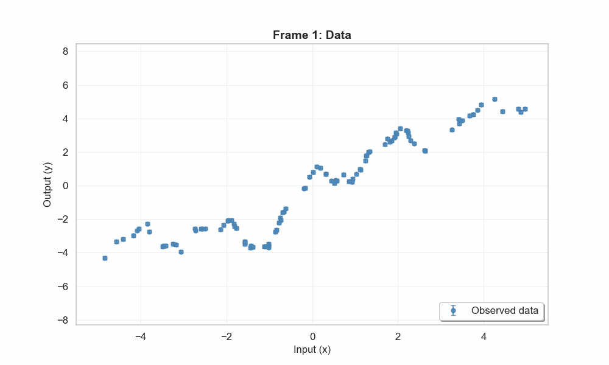
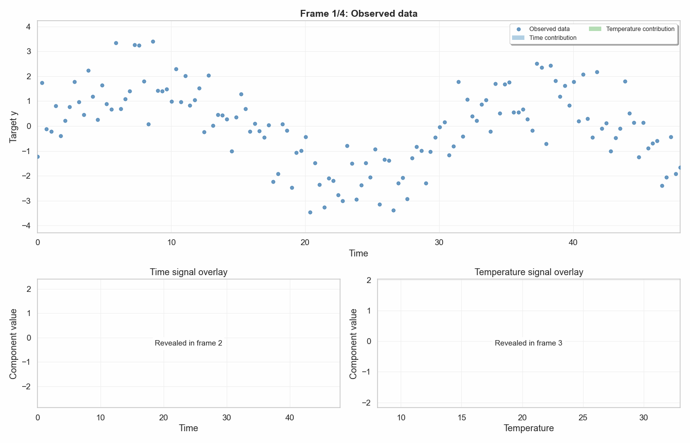

# Gaussian Process Visualizations

A collection of  Jupyter notebooks that build up intuition for **Gaussian Processes (GPs)** through step-by-step visualizations.

## Examples

### `gp_prior_posterior.ipynb` — GP Prior -> Posterior
- GP **prior** mean with 2-sigma confidence band
- GP prior with 3 random draws
- GP **posterior** updating as observations are added one by one (animation)

| Prior CI | Prior + random draws | Posterior (updating) |
|---|---|---|
|  |  |  |

### `gp_hyperparams.ipynb` — Effect of hyperparameter
Demonstrates GP regression with a squared-exponential (RBF) kernel on synthetic data:
- Raw data with noise error bars
- GP fit with the **correct** length-scale (ℓ = 1.0)
- GP fit with a **too-short** length-scale (ℓ = 0.3) — over-fitting
- GP fit with a **too-long** length-scale (ℓ = 3.0) — under-fitting
- Random function samples drawn from each model

| Correct ℓ | Short ℓ | Long ℓ |
|---|---|---|
|  |  |  |


### `gp_kernels.ipynb` — Kernel Comparison
Shows random draws from the GP prior and posterior fitting for three kernels: Squared Exponential, Linear, and Periodic.


| Squared Exponential | Linear | Periodic |
|---|---|---|
|  |  |  |

### `gp_kernel_addition.ipynb` — Additive Kernel Animation
This notebook shows how the GP posterior changes as kernels are added one by one on the same dataset. It progresses through four frames: data only, linear, linear + periodic, and linear + periodic + exp-square, with uncertainty shown as a shaded confidence interval and dashed CI bounds in posterior frames.



### `gp_signal_seperation.ipynb` — Additive Signal Seperation
This notebook uses an additive GP kernel to separate an observed target into two latent components:
- A smooth time-driven signal
- A more fluctuative temperature-driven signal

The final animation overlays transparent stacked component bars on the main time-vs-target plot, and shows the recovered component signals alongside their true generating signals.



## Installation

```bash
pip install -e .
```


## external Links
[Interactive GP App](https://infallible-thompson-49de36.netlify.app/)

